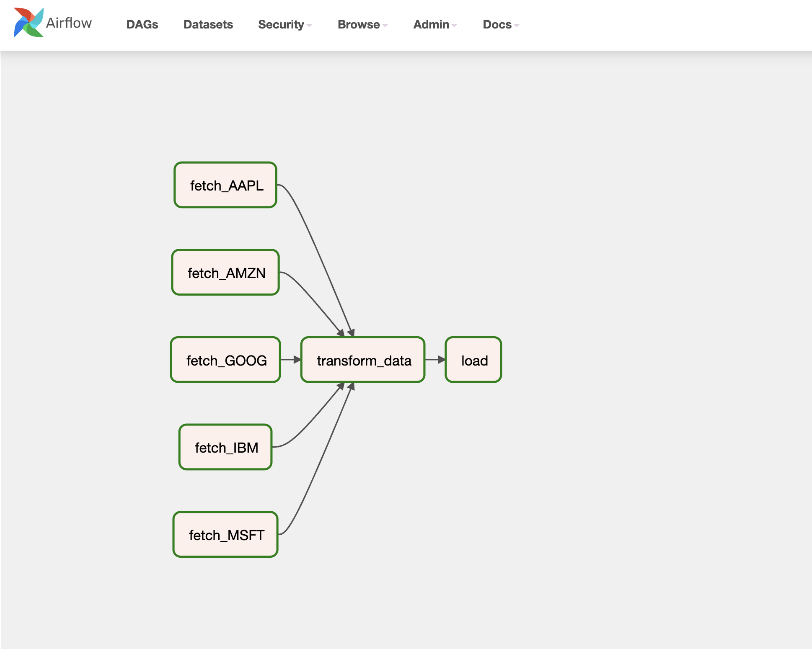
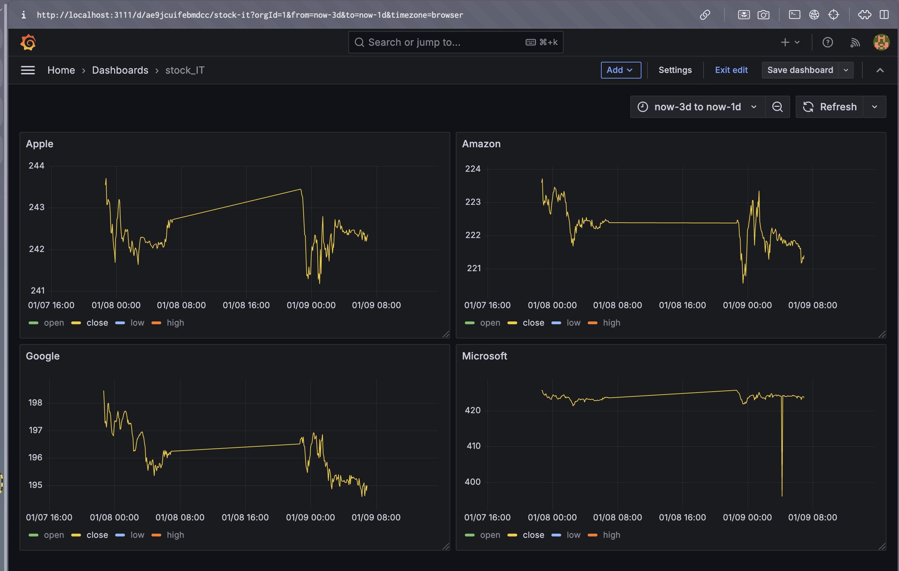

Stock Market ETL and Visualization Project

This project automates the process of fetching, transforming, and visualizing stock market data using modern data engineering tools. The pipeline extracts data from the Alpha Vantage API, processes it, and stores it in PostgreSQL, with visualization handled by Grafana.




## Features

- **ETL Pipeline**: Automated data ingestion, transformation, and loading using Apache Airflow.
    
- **Data Storage**: PostgreSQL as the primary database for stock and stock price data.
    
- **Visualization**: Grafana dashboards for real-time monitoring of stock data.
    
- **Scalability**: Containerized setup using Docker and Docker Compose.
    

## Tools and Technologies

- **Airflow**: Orchestrates the ETL pipeline.
    
- **PostgreSQL**: Stores structured stock market data.
    
- **Grafana**: Visualizes stock market data.
    
- **Docker**: Simplifies deployment and management.
    

### Configure Environment Variables

Create a `.env` file in the root directory and set your environment variables:

```
ALPHA_VANTAGE_API_KEY=<your_api_key>
POSTGRES_USER=airflow
POSTGRES_PASSWORD=airflow
POSTGRES_DB=airflow
GRAFANA_ADMIN_USER=admin
GRAFANA_ADMIN_PASSWORD=admin
```

### Start the Containers

Run the following command to build and start all services:

```
docker-compose up --build
```

### Access Services

- **Airflow**: http://localhost:8080
    
    - Username: `airflow`
        
    - Password: `airflow`
        
- **Grafana**: http://localhost:3111
    
    - Username: `admin`
        
    - Password: `admin`
        

### Add Grafana Dashboard

1. Log into Grafana.
    
2. Add a PostgreSQL data source pointing to your `postgres` container.
    
3. Create or import a dashboard to visualize stock data.
    

## Project Structure

```
.
├── dags/
│   ├── etl_stock.py          # Airflow DAG definition for ETL
├── logs/
├── plugins
├── config
├── postgres-init-scripts/
│   ├── init.sql              # SQL script to initialize database tables
├── .env                      # Environment variables
├── docker-compose.yml        # Docker Compose file
```

## Airflow DAG Details

- **Fetch Data**: Fetches stock data from Alpha Vantage.
    
- **Transform Data**: Cleans and formats the fetched data.
    
- **Load Data**: Inserts the transformed data into PostgreSQL.
    
## Future Enhancements

- Integrate Apache Kafka for real-time data ingestion.
    
- Add Spark for large-scale data processing.
    
- Automate Grafana dashboard creation using CLI tools or APIs.